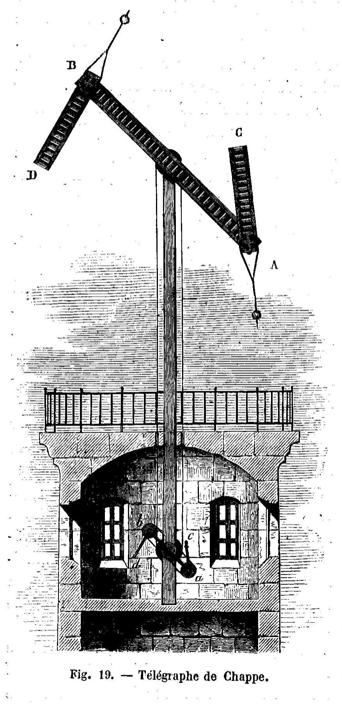

# Chappe[^1]
<a href="docs/images/chappe-telegraph.jpg"></a>

A simple proof-of-concept to transfer a file from a remote Linux terminal to a
local computer using a camera recording. The sender displays Unicode block
patterns; the receiver extracts the original bytes from the video. No network
access is required during transfer.

Binary files and streaming stdin are supported, with an 80-column × 24-row
terminal as the minimum display size.

## Send

Copy or create `send.sh` on the remote machine. It requires **Bash 4+ and GNU
coreutils**, with no additional encoder dependencies.

```bash
bash send.sh input.bin
```

Start recording before pressing Enter. Keep the entire white border visible,
and record through the final screens.

The terminal must support ANSI escape sequences, UTF-8, and single-width block
glyphs. Sextants encode six bits per cell by default. If your terminal cannot
render them correctly, select quadrants, which encode four bits per cell:

```bash
bash send.sh --mode quadrant input.bin
```

The sender preserves the current font, buffers one page, and uses bounded pipes.
Ctrl-C restores the terminal display, cursor and wrapping.

```bash
# Short camera trial
head -c 10000 input.bin | bash send.sh -

# Slower display for a difficult recording
bash send.sh --interval .5 input.bin

# Optional streaming compression, if gzip is installed
gzip -n -c input.bin | bash send.sh -
```

The default hold time is 0.3 seconds per screen, roughly nine camera frames at
30 fps. Sextants carry 1,026 bytes per screen; quadrants carry 684. At the
default interval, theoretical throughput is 3,420 or 2,280 bytes/s respectively,
before terminal-write overhead and the seven opening/closing screens. A typical
mid-low range phone camera capturing 30 fps will generally produce decodable
video with an interval as low as 0.1 seconds, for a transfer rate of ~ 10kb/s.
Keep the entire terminal including the border in view when recording.

The sender prepares the next screen while the current screen remains visible,
then waits only for the unused part of the hold interval. Timing starts after
each terminal write completes. Slow input or preparation extends that screen's
hold; subsequent screens still get their full interval, with no catch-up burst.
The final screen is held before restoring the terminal. `--interval 0` disables
pacing, and dump mode always runs without timing delays.

## Receive

Use **Python 3.10+** on the local computer. Install NumPy and OpenCV:

```bash
python3 -m venv .venv
. .venv/bin/activate
python -m pip install -r requirements.txt
python receive.py recording.mp4 -o recovered.bin --report quality.json
```

The receiver finds the border, corrects perspective and rotation, and measures
brightness inside each block. It fits visible border edges to tolerate modest
corner clipping, provided the payload and enough of each edge are still visible.
It reads the encoding mode automatically, tries multiple border and payload
brightness thresholds, and combines header copies and repeated frame
observations. Each camera frame contributes at most once to a page's temporal
average, even if several candidate borders are tried. It uses no OCR or font
templates.

Output is written atomically **only when every page passes its checksum and the
end marker confirms the page count**. Existing output requires `--force`; even
with that flag, an incomplete transfer leaves the file untouched.

| Exit status | Meaning |
|---|---|
| 0 | Complete, checksum-verified output written |
| 2 | Incomplete transfer; output not written |
| 1 | Fatal decoding or I/O error |

Invalid command-line arguments also exit with status 2. The optional JSON
report lists missing page ranges with inclusive, zero-based endpoints. Without
the end marker, the remaining tail is unknown. Console output summarizes
recovery; `--report` retains the full diagnostics. Reports are replaced
atomically, and input, output and report paths must refer to different files,
including when hard links or symbolic links are used.

If other bright rectangles interfere with detection, use `--crop X Y W H` to
restrict the image, retaining the whole border and some margin. Coordinates are
in decoded video pixels, after OpenCV's orientation handling. The default
output limit is 8 GiB; override it with `--max-bytes N`.

For a compressed transmission:

```bash
python receive.py recording.mp4 -o recovered.gz && gzip -dc recovered.gz > recovered.bin
```

## Reliability and limits

CB01 includes alignment references, three quadrant-encoded header copies, page
numbers, and 128-bit truncated SHA-256 checksums binding each header to its
payload. The receiver stores checked pages in temporary SQLite storage, keeping
payload RAM use bounded. Allow disk space for both those pages and final
output. Temporary state is removed on exit, including after incomplete
recovery.

There is **no error correction, selective repair, session identifier, or
transmitted whole-file digest** in v1. Missing pages require another recording.
The reported output SHA-256 is computed locally. Conflicting checked pages,
modes or end counts are rejected, but separate transfers cannot reliably be
distinguished: keep each recording to one transfer.

Camera blur, movement and terminal rendering still affect recovery. The
included physical recording recovers byte for byte, but that does not guarantee
every font or recording condition will work. See [PROTOCOL.md](PROTOCOL.md) for
the exact wire format.

## Development

```bash
python -m unittest discover -s tests -v
bash send.sh --dump input.bin > screens.txt
```

Tests cover binary encoding and page boundaries, corrupted observations,
incomplete transfers, synthetic compressed videos (including adjacent window
decoration), and a physical recording. Dump mode emits 24 UTF-8 lines per screen followed by a form feed,
without ANSI escapes or delays.

```text
send.sh                 Standalone remote sender
receive.py              Local video receiver
requirements.txt        Receiver and test dependencies
VERSION                 Release version
PROTOCOL.md             CB01 layout and checksum specification
tests/                  Sender and receiver tests
tests/fixtures/          Physical recordings and original source bytes
```
[^1]: https://en.wikipedia.org/wiki/Chappe_telegraph
